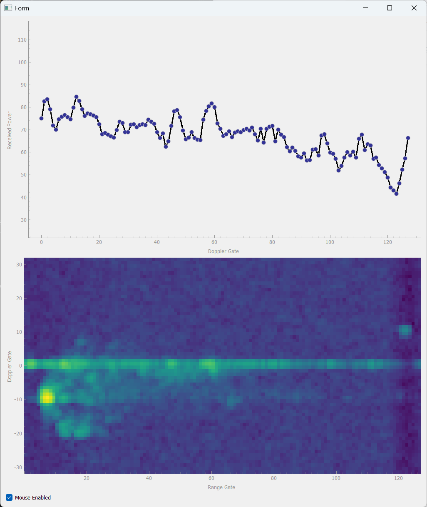
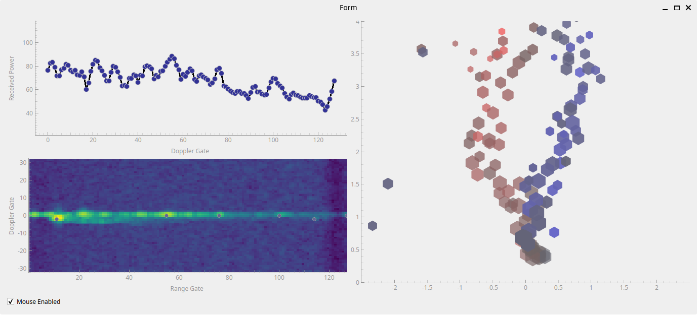

# radar_demonstrator
Educational display using a PC and a TI xWRx radar evaluation module to show how radar works.

## Ideas

* High level
    1. Speed display only
	    * kick/throw ball towards radar, radar behind soccer goal
		* wave arms, kick legs
		* simple, but speed diuplay alone of limited educational value; need to show how the speed is estimated
		* could do discrete FMCS radar instead of chipset -> show blockdiagram, raise educational value
	2. Soccer ball tracker
	    * kick ball towards goal / Torwand
		* show track of ball either as persistent point cloud or from actual tracking algo
	3. Interactive range-Doppler matrix (and other radar measurments)
	   * walking in front of radar show complex micro-Doppler signature of torso, arms, legs, etc.
	   * lots of information in single animated plot
	   * interactivity should allow intuitively understanding whats going
	   * actual explanation too complex for a few slides
	   * make it pretty and reactive

### Interactive radar data

* Setup
	* radar pointed at users
	* PC+monitor to capture radar measurement results in real time and show radar perception to user

* Sensor 
    * TI AWR1642BOOST 
        AWR1642 ES1 only supported by TI mmWave SDK <= 1.2;  
		Azimuth only;  
	    point clound and range-doppler map output via UART 
		no signal processing required on PC
	* TI AWR2544LOPEVM 
	    streams RFFT data via Ethernet. Doppler- and angle-estimation on PC 
		su pports Azimuth and Elevation; much higher angular resolution and range vs. AWR1642
		some effort to implement signal processing on PC, e.g., 4D FFT (range, Doppler, Azimuth, Elevation) + CFAR
	* Acconeer pulsed coherent radar sensor XM125 / A121 
	    no angle information

* User Interface / Interactivity
	* timed switch between different views: point cloud, rage-Doppler map, ...
	* allow user to manipulate UI (rotate, zoom, change view)? 
		* Would require touchscreen or similar. 
		* Gesture control through radar (very high effort unless we use a TI demo with this specific feature)
	* provide targets with interesting radar properties? 
	    * trihedral corner reflector to get strong, stable target
		* fan to show Doppler

* Data to show
    * Point cloud with persistence (medium)
	* Range profile (easy)
    * Range-Doppler map (easy)
	* Angle spectrum of single target (medium; how to select target of interest?)
	* Range-Azimuth map (easy if available from sensor)
	* Tracks of people moving? (high implementation effort)

* Implementation
    * processing on mini PC w/ full Linux distribution
	* Data collection and processing in Python
	    * 3d pointcloud
		* 2d range-azimuth map (check if supported my mmw demo)
		* 2d range-Doppler map
		* TI demo: UART likely not fast enough to output all at reasonable frame rate
	* could use ROS2 with rviz visualization for point cloud
	* alternatively, custom point cloud 3D plot
	   * PyQtGraph fast but ugly, only for point cloud
	   * Matplotlib can do everything, pretty but slow -  with some optimization (blitting), it should be good enough
	   * without direct user interaction, we only need to be fast enough to keep up with radar cycles
	* GUI: 
	    * PyQT? 
		* Just plain Matplotlib? 
		* Jupyter slides? Can those have real-time animated plots?
		* Webapp? Could render the plots to png and server via HTTP, have a client load and display them in a loop (JS). Could potentially embed into some kind of HTML slideshow as a movie player of sorts?
		* Show slides with explanation or just animated plots?
		* Keep slides and animation windows separate?

### Status

1. TI Demo + Python Matplotlib Range-Doppler Matrix  
	very quick to implement, already has 80% of the information 
	* Matplotlib too slow for high-resolution full-screen imshow()
	* pyqtgraph much faster. This is the way to go. 
	
	

2. Add "map" view of target list with some persistence
	walking away from radar and back:
	
	

3. Next: Add multiple switchable pages / tabs to separate out the plots