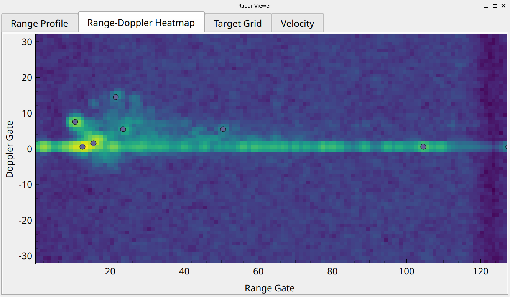

# radar_demonstrator
Educational display using a PC and a TI xWRx radar evaluation module to show how radar perceives the world.

* [Usage](#usage) 
* [Status](#status) 
* [Ideas](#ideas) 

## Usage

Python interpreter: Install the dependencies from requirements.txt, preferrably into a virtual environment. Ubuntu 24.04 with Python 3.12 was used for development. Python 3.14 also appeared to work. Check that Qt5 packages are available for the Python version of your choice. 

```bash
python -m venv .venv
. .venv/bin/activate
pip install -r requirements.txt
```

To run the GUI with alls plots in a single window:
```bash
python ui/main.py
```

Run the GUI with the plots in separate tabs:
```bash
python ui/main.py --tabs
```

The easiest way to get larger labels for better readability in a kiosk-type display is to ask Qt to scale the text as follows. Adjust the scale factor to your display:
```bash
QT_SCALE_FACTOR=2 python ui/main.py --tabs
```

## Status

1. TI Demo + Python Matplotlib Range-Doppler Matrix &#x2713;

	very quick to implement, already has 80% of the information 
	* Matplotlib too slow for high-resolution full-screen imshow()
	* pyqtgraph much faster. This is the way to go. 
	
	

2. Add "map" view of target list with some persistence &#x2713;

	walking away from radar and back:
	
	
	
3. Add velocity plot and highscore &#x2713;

	
	
4. Add multiple switchable pages / tabs to separate out the plots &#x2713;

	
	

5. Make labels readable from further away -> larger fonts, better contrast &#x2713;

	QT_SCALE_FACTOR=2

    

6. Convert Doppler gates to actual velocities in m/s (TODO)

## Ideas

* High level
    1. Speed display only
	    * kick/throw ball towards radar, radar behind soccer goal
		* wave arms, kick legs
		* simple, but speed diuplay alone of limited educational value; need to show how the speed is estimated
		* could do discrete FMCS radar instead of chipset -> show blockdiagram, raise educational value
	2. Soccer ball tracker
	    * kick ball towards goal / Torwand
		* show track of ball either as persistent point cloud or from actual tracking algo
	3. Interactive range-Doppler matrix (and other radar measurements)
	   * walking in front of radar show complex micro-Doppler signature of torso, arms, legs, etc.
	   * lots of information in single animated plot
	   * interactivity should allow intuitively understanding whats going
	   * actual explanation too complex for a few slides
	   * make it pretty and reactive

### Interactive radar data

* Setup
	* radar pointed at users
	* PC+monitor to capture radar measurement results in real time and show radar perception to user
	* mount PC+monitor+radar onto a movable display stand? 
	* if to run onaccompanied, need full housing to prevent people from fiddling with the cables

* Sensor: TI AWR1642BOOST
    * AWR1642 ES1 only supported by TI mmWave SDK <= 1.2
	* Azimuth only
	* point clound and range-doppler map output via UART, no signal processing required on PC

* User Interface / Interactivity
	* timed switch between different views: point cloud, rage-Doppler map, ...
	* provide targets with interesting radar properties? 
	    * trihedral corner reflector to get strong, stable target
		* fan to show Doppler? Might not have enough RCS.

* Data to show
    * ~~Point cloud with persistence (medium)~~  &#x2713;
	* ~~Range profile (easy)~~ &#x2713;
    * ~~Range-Doppler map (easy)~~ &#x2713;
	* Angle spectrum of single target (medium; how to select target of interest?)
	* Range-Azimuth map (easy if available from sensor)
	* ~~Tracks of people moving? (high implementation effort)~~ -> point cloud with persistance; &#x2713;

* Implementation
    * visualization on mini PC w/ full Linux distribution (Lenovo M92p tiny)
	* Data collection and processing in Python
	* GUI: PyQT + pyqtgraph
	
