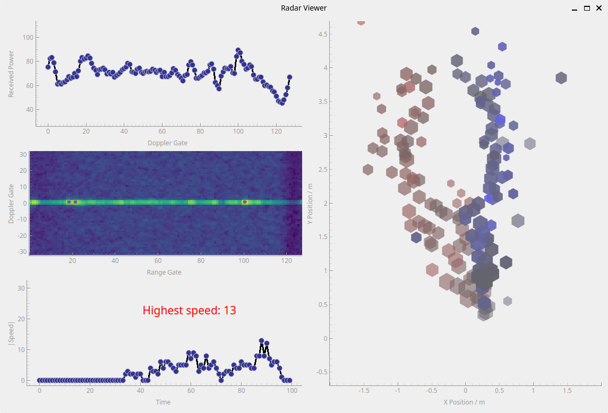
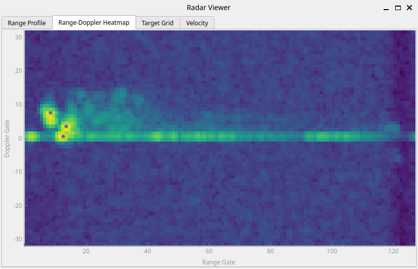
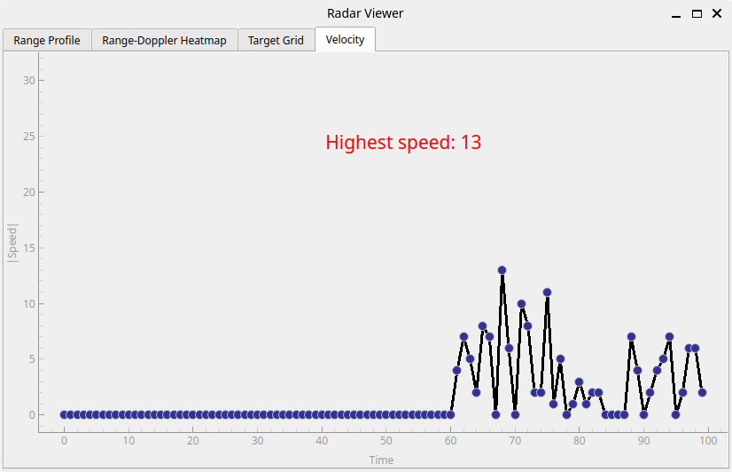

# radar_demonstrator
Educational display using a PC and a TI xWRx radar evaluation module to show how radar works.

## Ideas

* High level
    1. Speed display only
	    * kick/throw ball towards radar, radar behind soccer goal
		* wave arms, kick legs
		* simple, but speed diuplay alone of limited educational value; need to show how the speed is estimated
		* could do discrete FMCS radar instead of chipset -> show blockdiagram, raise educational value
	2. Soccer ball tracker
	    * kick ball towards goal / Torwand
		* show track of ball either as persistent point cloud or from actual tracking algo
	3. Interactive range-Doppler matrix (and other radar measurements)
	   * walking in front of radar show complex micro-Doppler signature of torso, arms, legs, etc.
	   * lots of information in single animated plot
	   * interactivity should allow intuitively understanding whats going
	   * actual explanation too complex for a few slides
	   * make it pretty and reactive

### Interactive radar data

* Setup
	* radar pointed at users
	* PC+monitor to capture radar measurement results in real time and show radar perception to user

* Sensor: TI AWR1642BOOST
    * AWR1642 ES1 only supported by TI mmWave SDK <= 1.2
	* Azimuth only
	* point clound and range-doppler map output via UART, 		no signal processing required on PC
	

* User Interface / Interactivity
	* timed switch between different views: point cloud, rage-Doppler map, ...
	* provide targets with interesting radar properties? 
	    * trihedral corner reflector to get strong, stable target
		* fan to show Doppler? Might not have enough RCS.

* Data to show
    * ~~Point cloud with persistence (medium)~~  done
	* ~~Range profile (easy)~~ done
    * ~~Range-Doppler map (easy)~~ done
	* Angle spectrum of single target (medium; how to select target of interest?)
	* Range-Azimuth map (easy if available from sensor)
	* ~~Tracks of people moving? (high implementation effort)~~ -> point cloud with persistance; done

* Implementation
    * visualization on mini PC w/ full Linux distribution (Lenovo M92p tiny)
	* Data collection and processing in Python
	* GUI: PyQT + pyqtgraph
	

### Status

1. TI Demo + Python Matplotlib Range-Doppler Matrix  
	very quick to implement, already has 80% of the information 
	* Matplotlib too slow for high-resolution full-screen imshow()
	* pyqtgraph much faster. This is the way to go. 
	
	

2. Add "map" view of target list with some persistence
	walking away from radar and back:
	
	
3. Add velocity plot and highscore
	
	* TODO: convert Doppler gate to m/s

4. Add multiple switchable pages / tabs to separate out the plots
	
	

